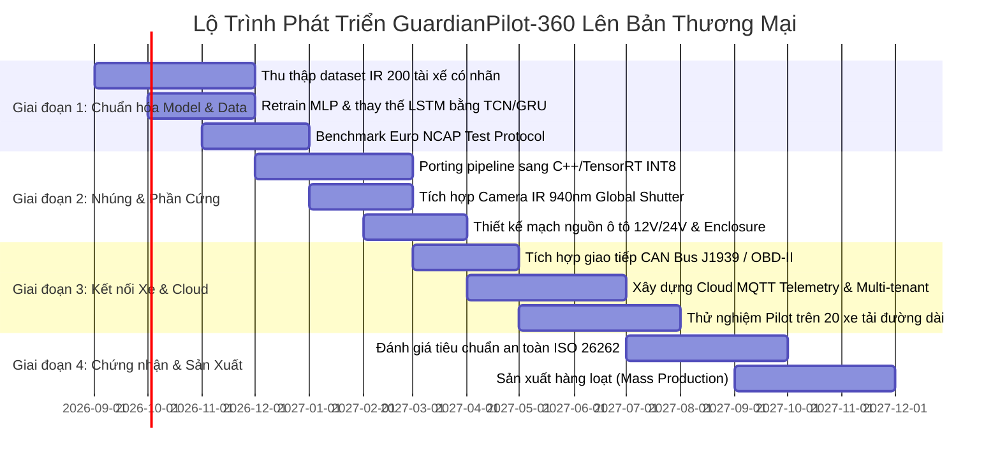

# GuardianPilot-360 — Báo Cáo Đánh Giá & Bộ Tiêu Chí Sản Phẩm Thực Tế (Production Readiness Framework)

> **Tài liệu thẩm định kỹ thuật & chuẩn hóa sản phẩm**  
> **Áp dụng cho:** Driver Monitoring System (DMS) — Phân khúc Xe Tải, Xe Khách & Đội Xe Doanh Nghiệp  
> **Tiêu chuẩn tham chiếu:** Euro NCAP 2026 DMS Protocol · ISO 26262 (ASIL-B) · UN ECE R46/R157

---

## 1. Tổng Quan Hiện Trạng: Từ MVP Sang Sản Phẩm Thương Mại

| Hạng mục | Trạng thái hiện tại (MVP / Demo) | Yêu cầu Sản Phẩm Thực Tế (Commercial DMS) |
|---|---|---|
| **Kiến trúc chạy** | Flask Web Server + Web Browser UI | Standalone C++/Python Daemon chạy trên Embedded Linux / RTOS |
| **Nguồn camera** | Web browser webcam / video upload | Camera IR 940nm qua giao tiếp MIPI CSI-2 / GStreamer hardware pipeline |
| **Model AI** | MediaPipe CPU + MLP (bias) + LSTM (kẹt tín hiệu) | Backbone trích xuất landmark tối ưu TensorRT INT8 / NPU (< 15ms latency) |
| **Tập dữ liệu kiểm thử** | 11 ảnh synthetic, chưa có ground-truth video | Benchmark dataset chuẩn (> 500 giờ video có nhãn đa dạng điều kiện) |
| **Tín hiệu xe** | Tốc độ mock qua REST API | CAN Bus (J1939 / OBD-II) đọc tốc độ, xi-nhan, góc lái thời gian thực |
| **Actuator cảnh báo** | Web Audio beep + UI flashing | Còi buzzer 85dB, đèn LED HUD, motor rung ghế/vô lăng, CAN-based trigger |
| **Độ tin cậy & An toàn** | Single process Python, concurrency lock | Watchdog phần cứng, fail-safe mode, chuẩn ISO 26262 ASIL-B |
| **Quản lý đội xe** | SQLite cục bộ, mock upload sync | MQTT Telemetry qua 4G/5G LTE, Cloud Multi-tenant, OTA Update A/B |

---

## 2. Bộ Tiêu Chí Đánh Giá Sản Phẩm Thực Tế (Production Criteria)

Để GuardianPilot-360 chuyển giao thành công thành một sản phẩm bán thương mại cho các hãng xe hoặc doanh nghiệp vận tải, hệ thống cần đáp ứng **6 nhóm tiêu chí cốt lõi** sau:

---

### Tiêu Chí 1: Độ Chính Xác & Đảm Bảo Chất Lượng Model (AI & CV Reliability)

```
                       ┌──────────────────────────────────────────────┐
                       │       Euro NCAP 2026 DMS Requirements        │
                       ├──────────────────────────────────────────────┤
                       │  • Microsleep (Eye closure > 1.5s): > 98%    │
                       │  • Prolonged Drowsiness (PERCLOS > 0.15):>95%│
                       │  • False Positive Rate: < 1 cảnh báo / 10 giờ│
                       │  • Distraction (Yaw > 25° > 3s): > 95%       │
                       └──────────────────────────────────────────────┘
```

1. **Xây dựng Dataset Ground-Truth có gán nhãn chuẩn hóa:**
   - Cần tối thiểu **200+ đối tượng tài xế** thuộc nhiều độ tuổi, giới tính, chủng tộc, cấu trúc mắt (mắt một mí, mắt hai mí).
   - Đủ các biến thể phụ kiện: Đeo kính râm, kính cận gọng dày, đeo khẩu trang, đội mũ bảo hiểm/nón lưỡi trai, có râu rậm.
   - Các kịch bản giả lập trên buồng lái mô phỏng (Driving Simulator): microsleep thật, ngáp liên tục, gật đầu do mệt mỏi, vừa lái vừa dùng điện thoại, nhìn gương chiếu hậu/bản đồ.

2. **Khắc phục triệt để Model Bias & LSTM Signal:**
   - **Retrain MLP:** Chuẩn hóa lại phân bố dữ liệu huấn luyện, bổ sung Negative Samples (người mắt hẹp hoặc nheo mắt nhưng đang tỉnh táo) để triệt tiêu việc trả `p_drowsy ≈ 0.58` khi mắt mở.
   - **Thay thế hoặc Tái cấu trúc LSTM:** Sử dụng kiến trúc mạng thời gian nhẹ hơn như **GRU** hoặc **Temporal Convolutional Network (TCN)** với sequence 30–60 frame, được train bằng contrastive loss hoặc focal loss trên chuỗi video buồn ngủ thực.
   - **Hiệu chuẩn Model (Calibration):** Áp dụng *Platt Scaling* hoặc *Temperature Scaling* để xác suất đầu ra phản ánh đúng độ tin cậy thực tế (confidence calibration).

3. **Thích ứng điều kiện ánh sáng khắc nghiệt:**
   - Ban đêm không có đèn đường (100% ánh sáng hồng ngoại IR).
   - Ánh sáng mặt trời chiếu trực diện vào kính xe gây chói lóa (direct glare).
   - Bóng râm cây cối chớp tắt liên tục khi xe di chuyển ở tốc độ cao (flickering shadow).

---

### Tiêu Chí 2: Phần Cứng Nhúng & Tối Ưu Edge Runtime (Embedded Edge Hardware)

```
Camera IR 940nm ──────► Hardware ISP ──────► NPU / GPU Core ──────► DMS Engine
(Global Shutter)       (Debayer/V4L2)        (TensorRT INT8)         (< 20ms)
```

1. **Thiết bị phần cứng mục tiêu (Target Embedded Hardware):**
   - **Cấp độ Pro:** NVIDIA Jetson Orin Nano / Orin NX (20–40 TOPS).
   - **Cấp độ Mass Production:** Rockchip RK3588, NXP i.MX8M Plus, hoặc Ambarella CV25.
   - **Yêu cầu nhiệt độ & độ bền:** Tiêu chuẩn Automotive Grade (-40°C đến +85°C), chống rung lắc cơ học chuẩn ISO 16750-3.

2. **Tối ưu hóa Pipeline Inference:**
   - Chuyển đổi toàn bộ pipeline sang **C++ / Rust** hoặc Python binding tối ưu hóa cao.
   - Xuất model sang **ONNX / TensorRT INT8 quantization** với calibration dataset để tăng tốc độ inference lên **≥ 30 FPS** mà chỉ tiêu thụ dưới **8W điện**.
   - Sử dụng **GStreamer / V4L2 zero-copy memory** để đưa frame trực tiếp từ camera ISP vào bộ nhớ GPU mà không qua CPU memory copy.

3. **Camera Sensor Chuyên Dụng:**
   - Cảm biến **Global Shutter** (chống nhòe chuyển động khi đầu tài xế di chuyển nhanh).
   - Đèn LED phát sáng bước sóng **940nm** (không nhìn thấy bằng mắt thường, không gây chói mắt tài xế ban đêm).
   - Ống kính góc rộng (Field of View 50°–65°) có lọc dải sóng hồng ngoại (Bandpass IR filter).

---

### Tiêu Chí 3: Tích Hợp Phương Tiện & Actuation (Automotive CAN Bus & Telematics)

1. **Giao tiếp Bus trên xe (Vehicle Telematics):**
   - Đọc dữ liệu trực tiếp qua **CAN Bus / J1939 (xe tải) / OBD-II (xe con)**:
     - Tốc độ xe thực tế (`Speed_kmh`).
     - Tín hiệu đèn xi-nhan (`Turn_Signal_Active` — nếu đang bật xi-nhan thì tài xế nhìn gương không bị tính là xao nhãng looking away).
     - Góc đánh lái vô lăng (`Steering_Angle`).
     - Trạng thái chân ga/phanh (`Throttle_Pedal_Position`, `Brake_Switch`).

2. **Hệ thống cảnh báo vật lý đa kênh (Multi-sensory Actuators):**
   - **Kênh Âm thanh:** Còi Buzzer công suất cao (80–90 dB) với tần số biến thiên theo cấp cảnh báo (Cấp 1: 1 beep nhẹ; Cấp 4: siren liên tục).
   - **Kênh Xúc giác:** Motor rung gắn trong đệm ghế lái hoặc vô lăng (Haptic feedback).
   - **Kênh Thị giác:** Dải đèn LED HUD gắn trên táp-lô trực diện tầm nhìn tài xế (Xanh lá → Vàng → Đỏ nhấp nháy).
   - **Kênh Can thiệp khẩn cấp (Phase 3):** Gửi tín hiệu CAN tới hệ thống ADAS yêu cầu bật đèn cảnh báo nguy hiểm (hazard lights) hoặc giảm tốc độ an toàn.

---

### Tiêu Chí 4: Tiêu Chuẩn An Toàn Chức Năng & Pháp Lý (Safety & Compliance)

1. **An Toàn Chức Năng ISO 26262 (Functional Safety - ASIL B):**
   - **Hardware Watchdog:** Mạch vi điều khiển giám sát độc lập (MCU watchdog). Nếu ứng dụng AI bị crash hoặc treo quá 500ms, watchdog lập tức khởi động lại hoặc kích hoạt còi cảnh báo lỗi hệ thống.
   - **Inference Sanity Check:** Bắt buộc có cơ chế dự phòng Rule-based (Rule-only fallback) chạy độc lập để nếu model ML bị lỗi, các quy tắc vật lý (mắt nhắm > 1.5s) vẫn luôn phát tín hiệu cảnh báo.
   - **Memory & Resource Bound:** Không được xảy ra Memory Leak; RAM sử dụng cố định không tăng dần theo thời gian lái (zero memory leak trong bài test 72 giờ liên tục).

2. **Tuân thủ Quyền Riêng Tư & Bảo Mật Dữ Liệu (Privacy & Security):**
   - **Edge-only Processing:** Toàn bộ quá trình nhận diện khuôn mặt xử lý 100% tại thiết bị trên xe, KHÔNG truyền video live liên tục lên cloud.
   - **Face Anonymization:** Snapshot gửi về máy chủ khi có sự kiện vi phạm phải được băm mã hóa (AES-256) hoặc làm mờ theo tiêu chuẩn GDPR / Nghị định 13/2023/NĐ-CP.
   - **Secure Boot:** Mã nguồn và model weights phải được ký số (Digital Signature), chống can thiệp hoặc trích xuất bản quyền model.

---

### Tiêu Chí 5: Hệ Thống Quản Lý Đội Xe & Vận Hành Từ Xa (Cloud Fleet Platform & OTA)

```
[Thiết bị trên xe (DMS)] ──(MQTT / 4G LTE)──► [Cloud Fleet Management Platform]
    ├── Cảnh báo thời gian thực                    ├── Bản đồ giám sát vị trí đội xe
    ├── Snapshot sự kiện vi phạm                   ├── Báo cáo KPI an toàn tài xế
    └── Nhật ký chuyến đi & PERCLOS                └── Quản lý cập nhật OTA Model/Firmware
```

1. **Giao thức truyền tin gọn nhẹ & Chống mất kết nối (Resilient Telemetry):**
   - Sử dụng giao thức **MQTT qua TLS (mTLS)** hoặc gRPC.
   - Cơ chế **Local FIFO Buffer (SQLite / RocksDB)**: Khi xe đi qua vùng mất sóng 4G (hầm, đèo núi), toàn bộ sự kiện được lưu trữ an toàn trong bộ nhớ flash và tự động đồng bộ (sync) ngay khi có mạng trở lại mà không mất dữ liệu.

2. **Cập nhật Từ xa (Over-The-Air - OTA Updates):**
   - Hỗ trợ cập nhật model AI, ngưỡng nhận diện (thresholds) và firmware hệ thống từ xa.
   - Sử dụng kiến trúc **A/B Dual Partitioning**: Nếu quá trình cập nhật bị ngắt điện giữa chừng, thiết bị tự động khôi phục lại phân vùng cũ (Rollback), tránh biến thiết bị thành "cục gạch" trên xe.

3. **Chấm Điểm An Toàn Tài Xế (Driver Safety Scoring & Fatigue Analytics):**
   - Tổng hợp chỉ số mệt mỏi theo ca làm việc (Shift Fatigue Index).
   - Đưa ra khuyến nghị thời gian nghỉ ngơi thông minh dựa trên chu kỳ sinh học và thời gian cầm lái liên tục.

---

## 3. Lộ Trình Triển Khai Lên Bản Thương Mại (Commercialization Roadmap)



---

## 4. Kết Luận & Khuyến Nghị Ngay Cho Team Kỹ Thuật

1. **Hiện tại:** Bản nâng cấp giao diện và các endpoint API `/api/health`, `/api/session/info` cùng các fix cho escape-valve giúp GuardianPilot-360 đạt chuẩn **Professional MVP / Pilot Demonstration Ready**.
2. **Khuyến nghị tiếp theo:**
   - Chuyển chế độ mặc định của hệ thống chạy ở **Rule-Engine kết hợp MLP đã hiệu chuẩn** trong khi chuẩn bị thu thập dataset có nhãn.
   - Đầu tư thiết bị thử nghiệm thực tế gồm **01 kit Jetson Orin Nano + 01 camera hồng ngoại 940nm** để thử nghiệm pipeline ánh sáng tối trước khi đưa lên xe thật.
